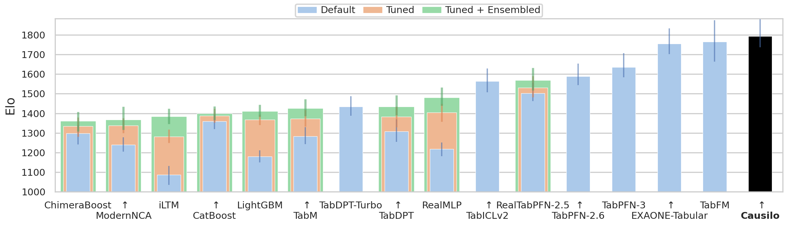
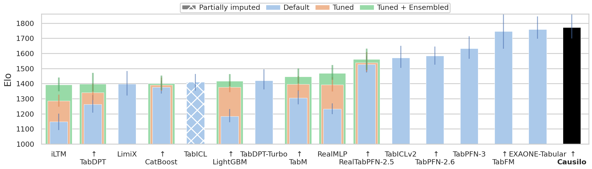
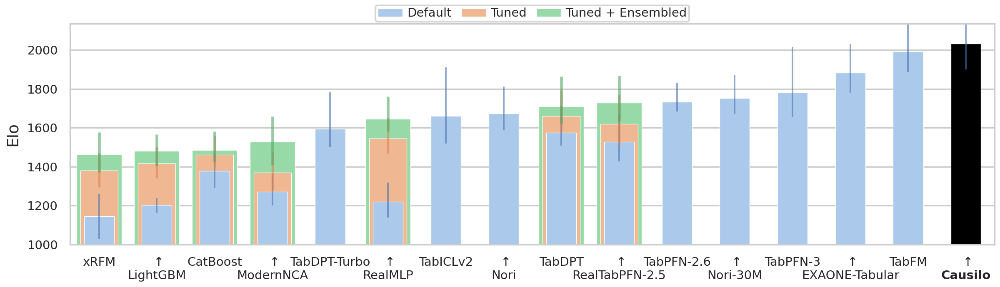

# Causilo

Causilo is a pretrained tabular foundation model from Nums AI Inc., supporting classification and regression through a scikit-learn interface.

[Apache-2.0 code](LICENSE) · [Causilo License v1.0 model weights](https://huggingface.co/nums-ai/causilo/blob/main/LICENSE) · [License & contact](#license--contact)

## Installation

Python 3.10–3.12 and PyTorch 2.13+ are required.

```bash
pip install causilo
```

The first fit automatically downloads and caches the task's [checkpoint](https://huggingface.co/nums-ai/causilo). `device="auto"` uses CUDA when available, otherwise CPU.

## Quick start

```python
from causilo import CausiloClassifier, CausiloRegressor

classifier = CausiloClassifier(n_estimators=8, random_state=42)
classifier.fit(X_train, y_train)
labels = classifier.predict(X_test)
probabilities = classifier.predict_proba(X_test)

regressor = CausiloRegressor(n_estimators=8, random_state=42)
regressor.fit(X_train, y_train)
predictions = regressor.predict(X_test)
```

Inputs can be NumPy arrays or pandas DataFrames, including categorical features and missing feature values. Use pandas categorical dtype for numeric category codes. NumPy object arrays infer numeric columns; strings and Booleans remain categorical. Prediction reuses the fitted schema, including handling unseen categories.

Classification supports up to 10 classes. Regression returns mean predictions by default and also supports median and quantile predictions. Targets must not be missing. See runnable [classification](examples/classification.py) and [regression](examples/regression.py) examples.

## Benchmarks

Evaluated using the official TabArena pipeline: 51 datasets, 51 Lite splits and 816 Full splits, using the default configuration with eight estimators and seed 42. System methods are excluded. Full plots show the top 16 model families by their best Elo, with default, tuned and ensembled variants.

**TabArena Full**

| Task           | Elo position | Elo ↑  | Improvability ↓ |
|:---------------|-------------:|-------:|----------------:|
| Overall        | 1 | 1792.9 | 0.0684 |
| Classification | 1 | 1771.8 | 0.0875 |
| Regression     | 1 | 2032.6 | 0.0125 |

<details>
<summary>TabArena Lite results</summary>

| Task           | Elo position | Elo ↑  | Improvability ↓ |
|:---------------|-------------:|-------:|----------------:|
| Overall        | 1 | 1817.4 | 0.0596 |
| Classification | 1 | 1780.1 | 0.0747 |
| Regression     | 1 | 2168.2 | 0.0155 |

</details>



*Overall — TabArena Full, classification and regression combined.*

<details>
<summary>Classification and regression</summary>



*Classification — TabArena Full, classification datasets only.*



*Regression — TabArena Full, regression datasets only.*

</details>

Local H100 80 GB comparison, one GPU and eight physical CPU cores per job:

| Model    |   Fit (s/1k) |   Predict (s/1k) |   CPU (GiB) |   GPU (GiB) |
|:---------|-------------:|-----------------:|------------:|------------:|
| **Causilo** | **2.504** | **0.251** | **1.94** | 8.15 |
| TabICLv2 | 3.449 | 0.303 | 2 | 8.37 |
| TabPFN-3 | 4.18 | 0.686 | 2.87 | **0.88** |

Times are median seconds per 1,000 rows; memory is mean peak usage during fit only. [Protocol, task-level resources and complete leaderboards](docs/benchmarks/README.md).

## Options

| Parameter | Default | Behavior |
| --- | --- | --- |
| `n_estimators` | `8` | Number of ensemble members to evaluate |
| `random_state` | `42` | Nonnegative integer seed for feature and class permutations |
| `device` | `"auto"` | One available CUDA device, otherwise CPU; explicit `"cpu"` or `"cuda:0"` is supported |
| `use_kv_cache` | `False` | Prepare and retain attention keys and values during fit |
| `retain_preprocessing` | `True` | Retain transformed training tables for later prediction |

Refit after changing options. Use `device="cuda:0"` to select a specific GPU, or `CUDA_VISIBLE_DEVICES` to control which GPUs are available.

Ensembles cycle through none, rank2gaussian, robust and power normalization. See [inference details](docs/inference.md) for quantile prediction, precision and reproducibility.

## Repeated prediction

Set `use_kv_cache=True` to move reusable context computation into fit, trading additional device memory for repeated prediction speed. With `retain_preprocessing=False`, fitted transforms are retained but transformed training tables are recomputed. See [cached prediction](examples/cached_prediction.py).

## Fitted-state storage

```python
import joblib

joblib.dump(classifier, "classifier.joblib")
restored = joblib.load("classifier.joblib")
```

Saved state includes fitted preprocessing and optional K/V caches, but excludes pretrained weights. Restoration loads the pinned checkpoint and reuses saved caches. It requires matching Causilo and dependency versions, including Python major/minor. See [save/restore](examples/save_restore.py).

## License & contact

Code is licensed under [Apache-2.0](LICENSE); model weights are separately licensed under [Causilo License v1.0](https://huggingface.co/nums-ai/causilo/blob/main/LICENSE). Non-commercial research and free research redistribution are permitted under its conditions. Commercial or production use, and hosted/API/SaaS services whether paid or free, require separate licenses. Contact contact@nums.world.
